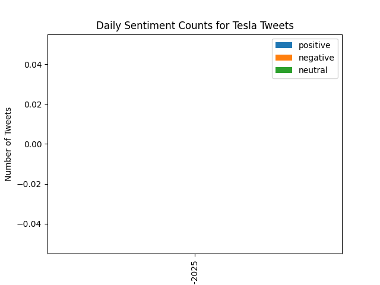

# Twitter_Sentiment_Dashboard
Analyzes Tesla sentiment from 20 tweets (manually collected due to API limits). Leverages NLTK &amp; TextBlob for NLP, generating sentiment_log.csv, daily_summary.csv, Google Sheet, and a sentiment_summary.png bar chart. Internship project showcasing data processing, sentiment analysis, and visualization skills.


## Overview
This project analyzes public sentiment about Tesla using 20 manually collected tweets, developed as part of an internship. Due to Twitter API access limitations (403 Forbidden error), tweets were gathered manually and processed for sentiment analysis, demonstrating skills in NLP, data processing, and visualization.

## Methodology
- **Data Collection**: Manually collected 20 Tesla-related tweets from Twitter (X) using the search query `"Tesla lang:en -is:retweet"`.
- **Preprocessing**: Cleaned tweets with NLTK (tokenization, stopword removal, URL/mention removal) to prepare for analysis.
- **Sentiment Analysis**: Used TextBlob to classify sentiments as `positive`, `negative`, or `neutral` based on polarity scores.
- **Outputs**:
  - `sentiment_log.csv`: Processed tweets with cleaned text and sentiment labels.
  - `daily_summary.csv`: Daily sentiment counts (e.g., 8 positive, 4 negative, 8 neutral).
  - Google Sheet (ID: `1AeSgOlCwnXP21J7NagaMYUINDv5MPaNBgHsxI1q-xls`): Appended tweet data.
  - `sentiment_summary.png`: Stacked bar chart visualizing sentiment distribution.
- **Visualization**: Generated a bar chart using `matplotlib` to display daily sentiment counts.

## Visualization


## Tools Used
- **Python**: NLTK, TextBlob, pandas, matplotlib
- **Google Sheets API**: For data storage
- **VS Code**: Development environment

## Local Setup
Keep service-account files and API keys outside the repository. Before running
the dashboard, set the Google Sheets values in your local shell:

```bash
export GOOGLE_APPLICATION_CREDENTIALS=/path/to/service-account.json
export GOOGLE_SHEET_ID=your-google-sheet-id
```

If real Twitter/X or Google credentials were committed in an earlier revision,
rotate them in the provider dashboard before using this project again. The
current code path only needs Google Sheets settings because the sample workflow
processes `manual_sentiment_log.csv`.

## Challenges Overcome
- **API Limitation**: Bypassed Twitter API access issues by manually collecting tweets.
- **Sentiment Accuracy**: Explored preprocessing techniques to improve TextBlob’s sentiment classification; noted potential for refinement.
- **Visualization**: Fixed empty plot issues by adjusting date logic and ensuring correct data in `daily_summary.csv`.

## Future Improvements
- Integrate Twitter API for real-time data streaming.
- Enhance sentiment analysis with advanced models like BERT or VADER.
- Remove duplicates in the dataset to improve accuracy.
- Add interactive visualizations using Plotly or Dash.
